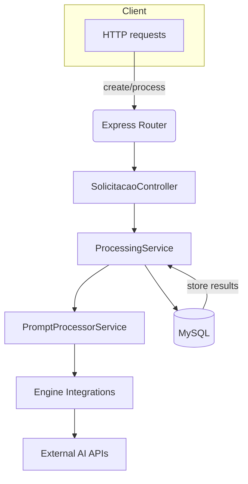

# Prompt Execution Pipeline API

This project exposes an HTTP API for creating and executing multi-step prompt pipelines that integrate a variety of AI services. It was designed to demonstrate how different generative models and external providers can be orchestrated in a single workflow.

## Features

- **Pipeline definition**: Submit a list of prompts where each prompt targets a specific engine (OpenAI, DALL‑E, Gemini, etc.). Results from previous steps can be referenced in later prompts using `{{placeholder}}` notation.
- **Scheduling**: Pipelines may run immediately or be scheduled using cron expressions.
- **Progress tracking**: Query the execution progress and fetch individual step outputs.
- **Extensible integrations**: Engines are implemented as independent modules so new providers can be added easily.
- **Swagger documentation**: API endpoints are documented via OpenAPI and served at `/api-docs`.

## Architecture



1. **SolicitacaoController** receives API requests and validates input.
2. **ProcessingService** loads the pipeline definition from MySQL and iterates through prompts.
3. **PromptProcessorService** selects the correct integration module based on the engine name.
4. **Engine Integrations** call external APIs (OpenAI, DALL‑E, etc.) and return structured responses.
5. Results are persisted so they can be used as placeholders in later steps or queried via the API.

A monthly cron job cleans old data to prevent uncontrolled growth.

## Setup

1. Install dependencies:
   ```bash
   npm install
   ```
2. Set the required environment variables:
   ```bash
   # Database
   export DB_HOST=localhost
   export DB_USER=myuser
   export DB_PASSWORD=mypassword
   export DB_NAME=promptexec

   # Example AI providers
   export OPENAI_API_KEY=...      # for OpenAIIntegration
   export DALLE_API_KEY=...       # for DallEIntegration
   export HUGGINGFACE_API_KEY=... # for Inference API integrations
   export GEMINI_API_KEY=...      # for GeminiIntegration
   export ELEVENLABS_API_KEY=...  # for ElevenLabsTextToSpeechIntegration
   ```
   Other integrations may require additional variables or parameters at runtime.
3. Start the server:
   ```bash
   npm start
   ```
   The API will listen on port `3000` by default.

## API Overview

The main endpoints are:

- `POST /solicitacoes` – create a new pipeline. Optionally include a cron expression to schedule execution.
- `POST /solicitacoes/{protocolo}/process` – manually start or restart processing for a pipeline.
- `POST /solicitacoes/{protocolo}/resume` – resume a partially completed pipeline.
- `GET /solicitacoes/{protocolo}/progress` – retrieve progress information.
- `GET /solicitacoes/{protocolo}/result` – fetch the final result once processing is complete.

Refer to `/api-docs` for the full OpenAPI specification containing all parameters and examples.

## Example Pipeline

```json
{
  "cron_expression": "*/5 * * * *", 
  "prompts": [
    {
      "engine": "openai",
      "model": "gpt-4o",
      "prompt": "Generate a product description for {{product}}"
    },
    {
      "engine": "dall-e",
      "model": "dall-e-3",
      "prompt": "Create an image based on {{0.result.data.description}}"
    }
  ]
}
```

The second prompt references the JSON path from the first step's result, allowing information to flow through the pipeline.

## Development Notes

- Database configuration lives in [`src/config/database.js`](src/config/database.js) and relies on environment variables to avoid committing credentials.
- Each engine under [`src/engines`](src/engines) exposes a `process(prompt, model, parameters)` method returning a consistent JSON structure.
- Cron tasks are defined in [`src/app.js`](src/app.js) using `node-cron`.

## License

This project is licensed under the MIT License. See [`LICENSE`](LICENSE) for details.
